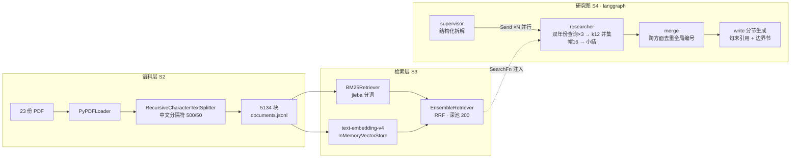

# argus-lg

**用 LangChain 生态原生件全链重写多 Agent 深度研究引擎 [Argus](../argus) 的对照实验仓。**
命题：不写一行自研基础设施（解析/切块/检索/录放/评测闸门全用生态件或砍掉），这套系统能走多远、会在哪里撞墙、每面墙值多少钱。代码零复制；语料（23 份 PDF）与金标题库（3 case × 6 must + 2 trap，人工标注）为复用数据资产。撞墙即实验数据——完整记录见 [PLAN.md](PLAN.md) 撞墙与替换记录①~⑥。

## 60 秒看懂



评测（S5）：金标 judge（structured output）+ 纯正则引用质标 + 忠实度抽样，防作弊四重承 Argus（金标先行 / 输入白名单 / quote 在场校验 / 陷阱要点）。

## 读数（三层仪表，全部可复跑）

| 层 | 指标 | argus-lg | 对照（argus v3：MinerU 解析 + 自研词频检索） |
|---|---|---|---|
| 语料 | 金标 18 要点在场率 | **18/18**（pypdf 纯 CPU 58.7s） | 18/18（MinerU GPU 60.7 分钟） |
| 检索 | 金标召回 recall@k（混合） | 12 / 14 / 16 / **18**（@4/8/12/16）；单路平台：BM25 13、向量 14 | ——（v3 无此层仪表；词频检索为端到端瓶颈） |
| 端到端 | 要点覆盖（三轮） | **7 → 11 → 9，均值 9**（轮间方差 ±2，见撞墙⑥） | 7/18（单轮，cassette 钉死） |
| 端到端 | 引用率 / 聚合句 / 越界 | **83.3% / 0 / 0**（分节生成后，三家 81.8~85.7%） | 76.1% |
| 端到端 | 忠实度抽样 / 陷阱泄漏 | **18/18 / 0**（三轮陷阱均 0） | 100% / 0 |

关键叙事：v3 的 lpz 0/6（财务数字类全灭）在本仓稳定 4~5/6——**混合检索按曲线配 k 的钱到账**；覆盖对外口径钉三轮均值，不摘单轮最高。

## 撞墙与替换总账（本仓主产出）

| # | 墙 | 裁决与结果 |
|---|---|---|
| ① | `ChatTongyi` 无标准 usage_metadata；langchain-community 整包日落 | 换 `langchain-openai` + 阿里官方兼容端点；控费=usage 折 ¥ 打印+花钱命令人工触发 |
| ② | BM25 默认空白切词毁中文；OpenAIEmbeddings tiktoken 预编码不容第三方端点；RRF 稀释单路命中 | jieba 挂 preprocess_func；`check_embedding_ctx_length=False`；深池 200 再切 top-k（曲线实测 @16 全收） |
| ③ | writer 引用聚堆（标题聚合 [1]..[55]） | render 不把编号放标题 + 句末硬约束，二跑实证回归 |
| ④ | writer 幻觉+装饰性引用（「监管警示」全语料无此事实，引退市样板页） | 忠实度指标+机检独立命中；非确定性（次轮自消）——每轮必跑指标的理由 |
| ⑤ | 引用纪律 prompt-only 不稳定（同 prompt 三形态振荡，84%→16.7%） | **write 分节生成**（每节小调用只见 ≤16 条证据）：三家 81.8~85.7%、聚合归零、忠实度池全满 |
| ⑥ | 覆盖轮间方差 ±2（temperature=0 不救） | 无录放层=每轮评随机样本；**cassette 的价格首次实测标出**（不带 core 的裁决不变）；对外口径=三轮均值 |

## 快速开始

零成本（无 key 可跑）：

```
uv sync
uv run pytest          # 32 项，全 Fake 零网络
```

花钱序列（复制 `.env.example` 为 `.env` 填百炼 key；金额为实测量级）：

```
uv run python scripts/ingest.py            # 解析切块，¥0
uv run python scripts/check_presence.py    # 在场率 18/18，¥0
uv run python scripts/embed.py             # 全量向量化 ≈¥0.76，分段可续跑
uv run python scripts/eval_retrieval.py --sweep 4,8,12,16   # 召回曲线 ≈¥0.001
uv run python scripts/run_graph.py lpz     # 整图真跑出报告 ≈¥0.09
uv run python scripts/eval_reports.py      # 端到端评测 ≈¥0.07/轮
```

可视化 demo（LangGraph Studio，生态原生调试器）：

```
uv run langgraph dev
```

打开打印的 Studio URL，Input 填 `{"company": "良品铺子", "slug": "lpz"}`，可视化观察 supervisor 拆解、Send 并行分支与逐节点状态。

## 代码地图

```
argus_lg/
  corpus.py      语料摄取（loader/切块/manifest/jsonl）
  presence.py    金标在场率（锚点匹配，S2 仪表）
  retrieval.py   BM25+向量+RRF 混合、SearchFn 工厂（S3）
  graph.py       研究图与全部 prompt（S4）
  eval.py        端到端评测四指标（S5）
  llm.py         模型接入与价目单一事实源
  studio.py      langgraph dev 入口
scripts/         每层一个薄 CLI（上表六件）
eval/            金标 cases.jsonl + 在场锚点 presence_anchors.json（数据资产）
reports/         s1_s3 管线报告 · s5 三轮评测报告
tests/           32 项，全 Fake（无 cassette 的测试策略：编排逻辑可测，模型行为靠指标）
```

## 已知边界（如实入档）

- 覆盖轮间方差 ±2：计划/查询层非确定级联，单轮读数不足为凭（撞墙⑥）。
- pypdf 深层合并表劈半病 88/5134=1.7%：未伤金标锚点与忠实度读数，但存在。
- szss 的 H 股公告类要点（m3/m4/m5）覆盖不稳：方面拆解未必生成「上市进程」主题，属计划层盲区。
- 全项目 API 实花 ≈¥1.79（S1~S5 累计，含三轮评测与九次整图真跑）。

## v0.2 候选（数据点名制：指标不点名不动工）

1. 计划/查询钉板或多轮采样评测——治撞墙⑥方差。
2. researcher 反思循环（条件回边+轮数上限）——触发条件：覆盖 miss 中出现"检索可及但查询没问到"类。
3. supervisor 复审补派——触发条件：系统性方面盲区（szss H 股类是候选证据）。
