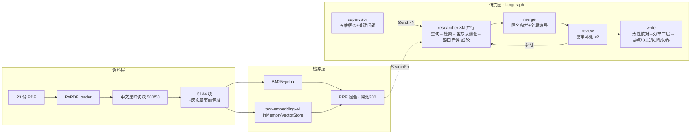

# argus-lg

**用 LangChain 生态件构建多 Agent 深度尽调引擎的两阶段实验仓。**

- **v0.1（tag `v0.1`）**：不写一行自研基础设施，LC 原生件全链重写 [Argus](../argus) 引擎——六步收口，回答"通用件能走多远、会在哪撞墙、每面墙值多少钱"。
- **v0.2（[开发全记录](reports/v02_devlog.md)）**：评审驱动迭代，把报告从几百字事实罗列推到 **6000~9000 字三层专业研报**——质量主仪器换成研报评分卡材料评审，金标评测降级为防幻觉底线闸门，四轮迭代 + 工程问题账 10 条全闭环。

语料（23 份 PDF）与金标（3 公司 × 6 must + 2 trap，人工标注）复用自 Argus；代码零复制。

## 60 秒看懂（v0.2 终态）



韧性层：请求级 timeout 120s ＋ 节点级 `RetryPolicy` ＋ 结构化输出 `RetryingStruct`（空返回重试+催办注入）。

## 读数（全部可复跑）

| 层 | 指标 | 读数 |
|---|---|---|
| 语料 | 金标 18 要点在场率 | **18/18**（pypdf 纯 CPU 58.7s；对照 v3 MinerU GPU 60.7 分钟同分） |
| 检索 | 金标召回曲线（混合，@4/8/12/16） | 12/14/16/**18**；单路平台 BM25 13、向量 14——k 是主杠杆 |
| 端到端 v0.1 | 要点覆盖三轮 | 7→11→9（均值 9，超 v3 基线 7；轮间方差 ±2 如实入档） |
| **端到端 v0.2** | 要点覆盖 / 陷阱 / 越界 / 忠实度 | **13/18（历史最高）/ 0×3 / 0 / 15/18**；报告 6000~9000 字三层结构 |

## 撞墙总账（实验主产出；v0.2 完整版见 [devlog](reports/v02_devlog.md)）

| 墙 | 裁决 |
|---|---|
| langchain-community 日落、ChatTongyi 无标准用量 | ChatOpenAI + 阿里官方兼容端点 |
| BM25 默认空白分词毁中文；tiktoken 预编码不容第三方端点；RRF 浅池稀释 | jieba 挂载；`check_embedding_ctx_length=False`；深池 200 再切 top-k |
| **百炼 json_schema 约束解码在三层嵌套 schema 上服务端挂死**（30 分钟黑洞→timeout 定位→对照实验定罪 46.5s vs 10.7s） | 图内结构化输出一律 `function_calling` |
| **function_calling 拒调且对特定输入粘性**（同输入三连拒） | 空返回重试 + 第二次起注入催办消息扰动输入 |
| 单点 API 故障杀全跑；客户端默认 600s 超时放大事故 | timeout=120s + 节点级 `RetryPolicy`（v1 自研重试组件的框架替代） |
| 引用纪律 prompt-only 不稳定（84%↔16.7% 振荡） | write 分节生成：单窗证据有界，多轮消化替代大窗投喂 |
| **数字语义错配（在场≠正确）**：非经常损益合计当现金流、季度行当全年、母公司表当合并、担保比例当负债率 | 表源纪律 prompt + 跨页章节面包屑（免重嵌：只进 metadata 与证据渲染）+ 写作前一致性核对 pass |
| **表列对齐错配（天花板）**：收入/成本/毛利率三列被读成年份对比——pypdf 压扁列对齐，prompt/架构层无解 | **通用解析件极限实测触达；处方=结构化表格解析——argus-platform 冻结 mineru-api 契约的最终实证** |

另有：验证器自身的切片预览偏差（一次错误定罪的公开更正）、硬编码年份（数据驱动语料概况修复）、评测轮间方差（=录放层价格实测）——全账见 devlog 与 [PLAN](PLAN.md)。

## 快速开始

零成本（无 key 可跑）：

```
uv sync
uv run pytest          # 38 项，全 Fake 零网络
```

花钱序列（`.env.example` → `.env` 填百炼 key；金额为实测量级）：

```
uv run python scripts/ingest.py            # 解析切块+章节面包屑，¥0
uv run python scripts/check_presence.py    # 在场率 18/18，¥0
uv run python scripts/embed.py             # 全量向量化 ≈¥0.76，分段可续跑
uv run python scripts/eval_retrieval.py --sweep 4,8,12,16   # 召回曲线 ≈¥0.001
uv run python scripts/run_graph.py lpz     # v0.2 深度报告 ≈¥1.2/次、~12 分钟
uv run python scripts/eval_reports.py      # 三家底线闸门 ≈¥0.4/轮
uv run langgraph dev                       # Studio 可视化（起服零调用）
```

## 代码地图

```
argus_lg/
  corpus.py      语料摄取 + 跨页章节面包屑 + 语料概况（产品对接缝）
  presence.py    金标在场率（锚点匹配）
  retrieval.py   BM25+向量+RRF 深池、SearchFn 工厂（含面包屑回贴）
  prompts.py     v0.2 专业提示词套件（尽调框架/检索策略/表源纪律/研报文体）+ 结构化模型
  graph.py       研究图（多轮 researcher/复审补派/分节三层写作）+ RetryingStruct
  eval.py        底线闸门四指标（防作弊：quote 在场校验/陷阱金标/聚合句计数）
  llm.py         模型接入与价目单一事实源（timeout/重试钉死）
  studio.py      langgraph dev 入口
scripts/         每层一个薄 CLI（上表七件）
eval/            金标 cases.jsonl + 在场锚点 presence_anchors.json（数据资产）
reports/         s1_s3 管线报告 · s5 三轮评测（含更正注）· v0.2 开发全记录
tests/           38 项全 Fake（无 cassette 的测试策略：编排可测，模型行为靠指标+材料评审）
```

## 已知边界（如实入档）

- **表列对齐**：通用解析件固有极限（见撞墙总账末条），报表深层数字须以「口径待核」态度读；根治在结构化解析层。
- 轮间方差：温度 0 不保证跨轮一致，单轮读数差异 ≤2 不足为凭；评审与对外口径按多轮看待。
- 引用率语义随报告形态变化：长分析段密度天然低于短事实句（62% vs v0.1 的 83%），硬指标（越界 0/陷阱 0）不变。
- v0.1 全程 ≈¥1.79；v0.2 全程 ≈¥8.0（含 ≈¥1.1 失败跑学费，每笔学费换一条问题账）。
